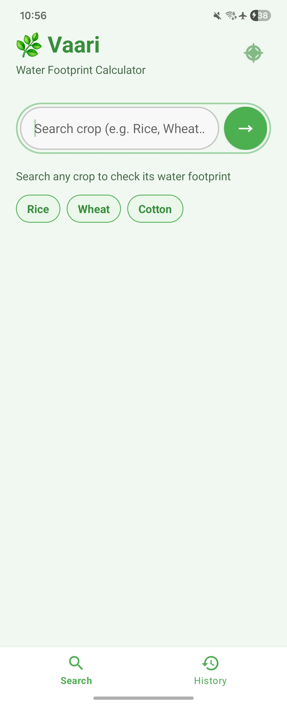

# Vaari

[](https://developer.android.com/)
[](https://kotlinlang.org/)
[](https://www.python.org/)
[](https://flask.palletsprojects.com/)
[](https://developer.android.com/training/data-storage/room)
[]()

Vaari is a multilingual Android application that helps users understand the **water footprint of agricultural crops** in a simple and accessible way. It lets users search for a crop, view its water footprint in litres, and see the breakdown of **green, blue, and grey water**.

The project is designed to make agricultural water data easier to understand for everyday users. It is developed as a mobile-first solution with a Kotlin Android app, a Python Flask backend API, and local Room Database storage.

## Features

- Crop search by name.
- Water footprint display in litres.
- Green, blue, and grey water breakdown.
- Search history storage.
- Multilingual support.
- Clean and simple mobile UI.
- Fast lookup through backend API integration.

## Screenshots

> Replace these placeholders with your actual app screenshots.

| Home Screen | Result Screen | History Screen |
|---|---|---|
|  |  |  |

## How It Works

1. The user opens the Android app.
2. The user enters a crop name.
3. The app sends the request to the backend API.
4. The backend fetches the crop footprint data.
5. The app displays the result on screen.
6. The search is saved in local history for later access.

## Tech Stack

- **Frontend:** Android, Kotlin, Jetpack Compose.
- **Backend:** Python Flask API.
- **Database:** Room Database.
- **Networking:** Retrofit.
- **Version Control:** Git and GitHub.

## Folder Structure

```text
Vaari/
├── app/
│   ├── src/
│   │   └── main/
│   │       ├── java/ or kotlin/
│   │       ├── res/
│   │       └── AndroidManifest.xml
├── backend/
│   ├── app.py
│   ├── requirements.txt
│   └── data/
├── docs/
│   ├── screenshots/
│   ├── diagrams/
│   └── reports/
├── gradle/
├── build.gradle
├── settings.gradle
└── README.md
```

## Installation

### Prerequisites

- Android Studio.
- JDK 17 or compatible.
- Python 3.10+.
- pip.
- Git.

### Android App Setup

```bash
git clone https://github.com/your-username/vaari.git
cd vaari
```

1. Open the project in **Android Studio**.
2. Let Gradle sync finish.
3. Run the app on an emulator or physical device.

### Backend Setup

```bash
cd backend
python -m venv venv
# Windows
venv\Scripts\activate
# macOS/Linux
source venv/bin/activate
pip install -r requirements.txt
python app.py
```

### Connect App to Backend

- Update the API base URL in the Android app.
- Make sure the backend server is running.
- Test a crop search from the app.

## Project Goal

The goal of Vaari is to make crop water footprint information easy to access and understand on mobile devices. Instead of using technical tools or manual calculations, users can simply search a crop and get an immediate answer in a user-friendly format.

## Why Vaari Matters

Water is one of the most important resources in agriculture, but many people do not know how much water different crops consume. Vaari helps bridge this gap by presenting crop water footprint data in a mobile-friendly way.

## Future Improvements

- Add offline support.
- Expand the crop dataset.
- Improve charts and visual analytics.
- Add more regional languages.
- Improve UI animations and data visualization.

## Organization

Vaari is developed under the broader water-awareness and clean-technology context aligned with the Bureau of Water Use Efficiency and the National Water Mission, Ministry of Jal Shakti.

## License

This project is for academic use.
